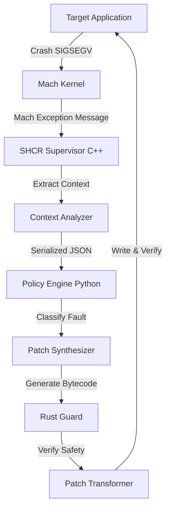

# SHCR System Architecture

The Self-Healing Code Runtime (SHCR) is a supervisor system designed to intercept, analyze, and patch runtime crashes on macOS (ARM64) without source code modification.

## High-Level Data Flow

## Core Components

### 1. Mach Exception Interceptor (C++)
- **Role**: Supervisor process that attaches to the child application via Mach ports (`task_set_exception_ports`).
- **Mechanism**: Intercepts `EXC_BAD_ACCESS`, `EXC_ARITHMETIC`, and `EXC_BAD_INSTRUCTION` before they become POSIX signals.
- **State**: Captures full thread state (`ARM_THREAD_STATE64`).

### 2. Context Analyzer
- **Role**: gathers forensics data.
- **Input**: Thread state, Fault Address.
- **Operations**:
    - Serializes registers (RIP, SP, X0-X28).
    - **Memory Read**: fetches the raw 32-bit instruction at the faulting address using `mach_vm_read_overwrite`.
- **Output**: JSON context object.

### 3. Patch Engine (Python)
- **Classifier**: 
    - Decodes ARM64 instructions (heuristically identifies Load/Store vs Branch).
    - Determines if fault is Recoverable (Memory) or Unrecoverable (Control Flow).
- **Synthesizer**:
    - Generates machine code patches.
    - **Strategies**:
        - `skip_instruction`: Replaces faulting instruction with `NOP` (`0xD503201F`).
        - `safe_return`: Forces function return (deprecated for general use due to stack corruption risk).

### 4. Runtime Guard (Rust)
- **Role**: The "Safety Gate".
- **Validation**: FFI-called from C++. Parses the proposed patch JSON.
- **Rules**:
    - Rejects patches on Branch/Call instructions.
    - Rejects patches with high complexity or unknown side effects.
    - Enforces "Allow Deny" lists.

### 5. Patch Transformer & Verification
- **Role**: Applies the patch to the live process.
- **Mechanism**:
    - `mach_vm_protect`: Temporarily sets page to `RWX` (or `RW-` then `R-X`).
    - `mach_vm_write`: Writes patch bytes.
    - **In-Memory Verification**: Reads back the written bytes to ensure integrity before resuming.
    - `sys_icache_invalidate`: Flushes instruction cache (implied by restart usually, but critical on ARM64).

## Infinite Loop Prevention

### Fault History & Escalation
- **FaultHistory**: Tracks frequency of crashes at specific addresses (`RIP`).
- **Threshold**: If > 3 crashes occur at the same RIP, checks for Progress.

### Non-Progress Detection
- **ProgressTracker**: Snapshots register state (X0-X28, SP, PC) at each crash.
- **Logic**: If a fault repeats > 5 times AND registers remain identical, it indicates a "Semantic Infinite Loop" (Zombie Bug).
- **Action**: Escalates to Process Termination to prevent CPU wasting.
